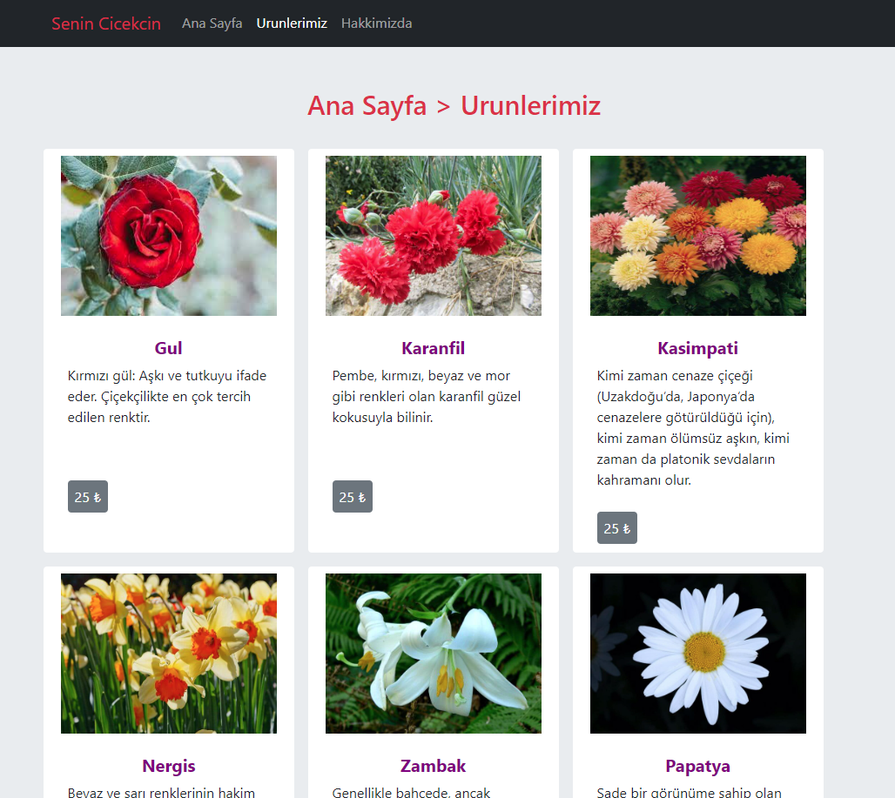

# Google Homepage Projesi
***[Patika.dev](https://www.patika.dev/tr)*** tarafindan sunulan, Başlangıç Seviye Frontend Web Development Patikası icin hazirladigim Bootstrap odevimi daha yakindan inceleyebilirsiniz.

## Projeler ve Odevler 
Bu veya baska herhangi bir projemi inceleyip, daha farkli yapmam gerektigini dusundugunuz durumlarda benimle istediginiz gibi iletisim kurabilirsiniz. Elestirilere tamamen acigim. :smile: :smile:

## Peki bu odev nedir?
Daha once yapmis oldugum odevlerde -profilimden bu odevi inceleyebilirsiniz; *[online-cicekcilik]https://github.com/akinizm/online-cicekcilik.git)*- Online cicekcilik tasarlamistim.  Simdi ise bunu Bootstrap kullanarak yaptim.

Egitimler sirasinda ogrenmis oldugum;

        - HTML,
        - CSS,
        - GIT ve GitHub kullanimi,
        - Markdown 
        - Bootstrap

gibi ogretilen konulari siklikla kullanmaya ve pratik yapmaya gayret ediyorum. Umarim bu yolda ilerlerken dogru atimlar atiyorumdur! :smiley:

`Odevin gorselini gorebilirsiniz;`

*[Patika.dev profilimi buradan ziyaret edebilirsiniz!](https://app.patika.dev/nomad)* 

